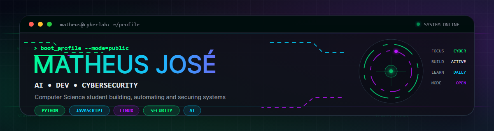

<p align="center">
  <picture>
    <source srcset="./assets/header.svg" type="image/svg+xml">
    
  </picture>
</p>

<p align="center">
  <a href="https://github.com/matheusjose04">
    
  </a>
  <a href="https://github.com/matheusjose04?tab=repositories">
    
  </a>
  
  
</p>

<p align="center">
  
</p>

---

## `> about --profile`

Sou estudante de Ciência da Computação com foco principal em **Cybersecurity**. Também estudo desenvolvimento, Linux, automação, infraestrutura e inteligência artificial para entender tecnologia de ponta a ponta.

```ini
name        = Matheus José
role        = Computer Science Student
main_focus  = Cybersecurity
learning    = Development, AI, Linux, Infrastructure, Automation
mindset     = Learn -> Build -> Test -> Secure
status      = Open to opportunities across IT
```

Conhecimento de segurança aqui é tratado com responsabilidade: estudo, laboratório, autorização e uso ético.

---

## `> current_focus --scan`

<table>
  <tr>
    <td width="50%">
      <h3>Security mindset</h3>
      <p>Fundamentos de cibersegurança, redes, Linux, boas práticas, análise de risco e desenvolvimento mais seguro.</p>
    </td>
    <td width="50%">
      <h3>Development practice</h3>
      <p>Projetos com Python, JavaScript, TypeScript, Java/Kotlin e tecnologias web para transformar estudo em código real.</p>
    </td>
  </tr>
  <tr>
    <td width="50%">
      <h3>Automation and infrastructure</h3>
      <p>Shell, Git, Docker, ambiente Linux, scripts e organização de fluxos para ganhar velocidade sem perder controle.</p>
    </td>
    <td width="50%">
      <h3>AI and applied learning</h3>
      <p>Uso de IA como apoio para pesquisa, prototipação, revisão de código e criação de ferramentas úteis.</p>
    </td>
  </tr>
</table>

---

## `> stack --load`

<p align="center">
  
</p>

<p align="center">
  
</p>

<p align="center">
  
  
  
  
</p>

---

## `> lab_status --run`

```bash
matheus@cyberlab:~$ ./status.sh

[+] Cybersecurity fundamentals ........ ACTIVE
[+] Linux and terminal ................ ACTIVE
[+] Networking concepts ............... LEARNING
[+] Secure development ................ BUILDING
[+] Backend and web ................... BUILDING
[+] Automation scripts ................ EXPLORING
[+] Infrastructure basics ............. EXPLORING
[+] Artificial intelligence ........... EXPLORING
[+] Open-source workflow .............. ACTIVE

[SYSTEM] continuous_learning=true
```

---

## `> projects --featured`

<table>
  <tr>
    <td width="50%">
      <h3><a href="https://github.com/matheusjose04/sistema-gerenciamento-tarefas">sistema-gerenciamento-tarefas</a></h3>
      <p>Sistema de gerenciamento de tarefas em Python, focado em organização, lógica de aplicação e prática de estruturação.</p>
      <p>
        
        
      </p>
    </td>
    <td width="50%">
      <h3><a href="https://github.com/matheusjose04/desafio-felipao-3">desafio-felipao-3</a></h3>
      <p>Prática com JavaScript para consolidar lógica, regras, entrada de dados e resolução progressiva de problemas.</p>
      <p>
        
        
      </p>
    </td>
  </tr>
  <tr>
    <td width="50%">
      <h3><a href="https://github.com/matheusjose04/desafio-2-do-felipao">desafio-2-do-felipao</a></h3>
      <p>Exercício de fundamentos em JavaScript, reforçando controle de fluxo, condições e organização de soluções.</p>
      <p>
        
        
      </p>
    </td>
    <td width="50%">
      <h3><a href="https://github.com/matheusjose04/desafio-felipao">desafio-felipao</a></h3>
      <p>Desafio da DIO para treinar lógica de programação, tomada de decisão e implementação de regras simples.</p>
      <p>
        
        
      </p>
    </td>
  </tr>
</table>

<p align="center">
  <a href="https://github.com/matheusjose04?tab=repositories">
    
  </a>
</p>

---

## `> github --stats`

<p align="center">
  
  
</p>

<p align="center">
  
</p>

---

## `> activity --graph`

<p align="center">
  
</p>

---

## `> contribution --snake`

<p align="center">
  <picture>
    <source media="(prefers-color-scheme: dark)" srcset="./assets/github-snake-dark.svg">
    <source media="(prefers-color-scheme: light)" srcset="./assets/github-snake.svg">
    
  </picture>
</p>

---

## `> connect --open`

<p align="center">
  <a href="https://github.com/matheusjose04">
    
  </a>
  <a href="https://github.com/matheusjose04?tab=repositories">
    
  </a>
  
</p>

```text
╔══════════════════════════════════════════════════╗
║              CONNECTION ESTABLISHED             ║
║                                                  ║
║          AI • DEV • CYBERSECURITY • IT          ║
║                                                  ║
║        LEARN // BUILD // TEST // SECURE         ║
╚══════════════════════════════════════════════════╝
```
