<div align="center">



<br>

<a href="https://github.com/matheusjose04">
  
</a>


<br><br>

<a href="https://git.io/typing-svg">
  
</a>

</div>

---

## `> whoami`

```text
┌──[matheus@cyberlab]─[~/profile]
└─$ whoami

Name       : Matheus José
Role       : Computer Science Student
Main Focus : Cybersecurity
Exploring  : Development • AI • Linux • Infrastructure • Automation • Security
Status     : Open to opportunities across IT
```

Sou estudante de **Ciência da Computação** com foco principal em **Cybersecurity**, sem me limitar a uma única área de tecnologia.

Gosto de desenvolvimento, Linux, automação, infraestrutura, inteligência artificial e segurança. Meu objetivo é compreender sistemas de ponta a ponta: **como são construídos, como funcionam, onde falham e como podem ser protegidos**.

---

## `> stack --load`

<div align="center">

### Linguagens & Desenvolvimento

<a href="https://skillicons.dev">
  
</a>

### Ferramentas & Ambiente

<a href="https://skillicons.dev">
  
</a>

</div>

---

## `> cyber_lab --status`

```bash
matheus@cyberlab:~$ ./status.sh

[+] Cybersecurity fundamentals ........ ACTIVE
[+] Linux ............................. ACTIVE
[+] Networking ........................ LEARNING
[+] Secure development ................ BUILDING
[+] Backend / Web ..................... BUILDING
[+] Automation ........................ EXPLORING
[+] Infrastructure .................... EXPLORING
[+] Artificial Intelligence ........... EXPLORING
[+] Open-source practice .............. ACTIVE

[SYSTEM] continuous_learning=true
```

> Cybersecurity knowledge is practiced for **ethical, authorized and educational purposes**.

---

## `> projects --featured`

<div align="center">

<a href="https://github.com/matheusjose04/sistema-gerenciamento-tarefas">
  
</a>

<a href="https://github.com/matheusjose04/desafio-felipao">
  
</a>

<a href="https://github.com/matheusjose04/desafio-2-do-felipao">
  
</a>

<a href="https://github.com/matheusjose04/desafio-felipao-3">
  
</a>

<br><br>

<a href="https://github.com/matheusjose04?tab=repositories">
  
</a>

</div>

---

## `> github --stats`

<div align="center">


<br><br>


</div>

> **Nota:** “Top Languages” representa as linguagens detectadas nos repositórios e não mede nível de domínio.

---

## `> activity --graph`

<div align="center">


</div>

---

## `> achievements --scan`

<div align="center">


</div>

---

## `> contribution_snake --run`

<div align="center">

<picture>
  <source media="(prefers-color-scheme: dark)" srcset="./assets/github-snake-dark.svg">
  <source media="(prefers-color-scheme: light)" srcset="./assets/github-snake.svg">
  
</picture>

</div>

---

## `> connect --open`

<div align="center">

<a href="https://github.com/matheusjose04">
  
</a>

<a href="https://github.com/matheusjose04?tab=repositories">
  
</a>

</div>

---

<div align="center">

```text
╔══════════════════════════════════════════════════╗
║              CONNECTION ESTABLISHED              ║
║                                                  ║
║         AI • DEV • CYBERSECURITY • IT           ║
║                                                  ║
║       LEARN // BUILD // TEST // SECURE           ║
╚══════════════════════════════════════════════════╝
```


</div>
