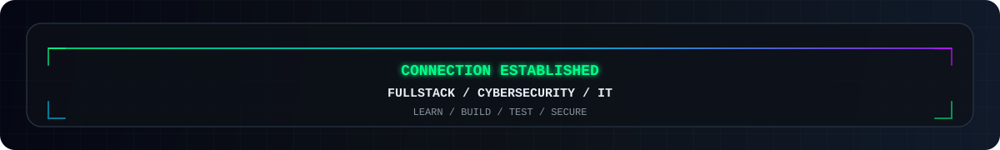

  <picture>
    <source srcset="./assets/header.svg" type="image/svg+xml">
    
  </picture>

  
  
  
  

  

  <strong>PT-BR</strong> — Estudante de Ciência da Computação com foco duplo em Desenvolvimento Fullstack e Cybersecurity: construo aplicações completas e estudo como esses sistemas falham, para protegê-los desde o início.
   
  <strong>EN</strong> — Computer Science student with a dual focus on Fullstack Development and Cybersecurity: I build full applications and study how those same systems break, so I can secure them from the start.

---

  

  

---

  <picture>
    <source media="(prefers-color-scheme: dark)" srcset="https://streak-stats.demolab.com/?user=matheusjose04&amp;hide_border=true&amp;background=0D1117&amp;stroke=00D4FF&amp;ring=BC13FE&amp;fire=00FF88&amp;currStreakLabel=00FF88&amp;sideLabels=8B949E&amp;currStreakNum=E6EDF3&amp;sideNums=E6EDF3&amp;dates=8B949E&amp;titleColor=00FF88&amp;card_width=1180">
    
  </picture>

  <picture>
    <source media="(prefers-color-scheme: dark)" srcset="https://raw.githubusercontent.com/matheusjose04/MatheusJose04/projects/stats.svg">
    <source media="(prefers-color-scheme: light)" srcset="https://raw.githubusercontent.com/matheusjose04/MatheusJose04/projects/stats-light.svg">
    
  </picture>

  <picture>
    <source media="(prefers-color-scheme: dark)" srcset="./assets/github-snake-dark.svg">
    <source media="(prefers-color-scheme: light)" srcset="./assets/github-snake.svg">
    
  </picture>

---

## `> projects --featured`

  <picture>
    <source media="(prefers-color-scheme: dark)" srcset="https://raw.githubusercontent.com/matheusjose04/MatheusJose04/projects/projects.svg">
    <source media="(prefers-color-scheme: light)" srcset="https://raw.githubusercontent.com/matheusjose04/MatheusJose04/projects/projects-light.svg">
    
  </picture>

  

---

  
  
  
  

  

