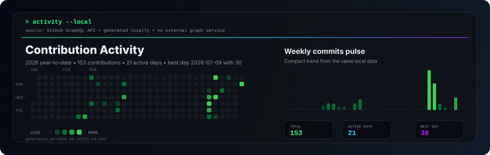

<p align="center">
  <picture>
    <source srcset="./assets/header.svg" type="image/svg+xml">
    
  </picture>
</p>

<p align="center">
  <a href="https://github.com/matheusjose04">
    
  </a>
  <a href="https://github.com/matheusjose04?tab=repositories">
    
  </a>
  
  
  
</p>

<p align="center">
  
</p>

---

## `> about --profile`

**PT-BR** — Sou estudante de Ciência da Computação com foco duplo em **Desenvolvimento Fullstack** e **Cybersecurity**. Construo aplicações completas (front, back e infraestrutura) e estudo como esses mesmos sistemas podem falhar, para desenvolvê-los com mais segurança desde o início.

**EN** — I'm a Computer Science student with a dual focus on **Fullstack Development** and **Cybersecurity**. I build full applications end to end (frontend, backend and infrastructure) and study how those same systems break, so I can build them more securely from the start.

```ini
name        = Matheus José
role        = Computer Science Student
main_focus  = Fullstack Development & Cybersecurity
learning    = Backend, Frontend, AI, Linux, Infrastructure, Automation
mindset     = Learn -> Build -> Test -> Secure
status      = Open to opportunities across IT
```

**PT-BR** — Conhecimento de segurança aqui é tratado com responsabilidade: estudo, laboratório, autorização e uso ético.
**EN** — Security knowledge here is handled responsibly: study, lab environments, authorization and ethical use.

---

## `> current_focus --scan`

<table>
  <tr>
    <td width="50%">
      <h3>Fullstack development</h3>
      <p><strong>PT-BR:</strong> Aplicações completas com Python, JavaScript/TypeScript, React e Node, cobrindo front-end, back-end, banco de dados e deploy.</p>
      <p><strong>EN:</strong> End-to-end applications with Python, JavaScript/TypeScript, React and Node, covering frontend, backend, database and deploy.</p>
    </td>
    <td width="50%">
      <h3>Security mindset</h3>
      <p><strong>PT-BR:</strong> Fundamentos de cibersegurança, redes, Linux, boas práticas, análise de risco e desenvolvimento mais seguro.</p>
      <p><strong>EN:</strong> Cybersecurity fundamentals, networking, Linux, best practices, risk analysis and more secure development.</p>
    </td>
  </tr>
  <tr>
    <td width="50%">
      <h3>Automation and infrastructure</h3>
      <p><strong>PT-BR:</strong> Shell, Git, Docker, ambiente Linux, scripts e organização de fluxos para ganhar velocidade sem perder controle.</p>
      <p><strong>EN:</strong> Shell, Git, Docker, Linux environment, scripts and workflow organization to move faster without losing control.</p>
    </td>
    <td width="50%">
      <h3>AI and applied learning</h3>
      <p><strong>PT-BR:</strong> Uso de IA como apoio para pesquisa, prototipação, revisão de código e criação de ferramentas úteis.</p>
      <p><strong>EN:</strong> Using AI as support for research, prototyping, code review and building useful tools.</p>
    </td>
  </tr>
</table>

---

## `> stack --load`

<p align="center">
  
</p>

<p align="center">
  
</p>

<p align="center">
  
  
  
  
</p>

---

## `> lab_status --run`

```bash
matheus@cyberlab:~$ ./status.sh

[+] Fullstack development ............. BUILDING
[+] Cybersecurity fundamentals ........ ACTIVE
[+] Linux and terminal ................ ACTIVE
[+] Networking concepts ............... LEARNING
[+] Secure development ................ BUILDING
[+] Backend and web ................... BUILDING
[+] Automation scripts ................ EXPLORING
[+] Infrastructure basics ............. EXPLORING
[+] Artificial intelligence ........... EXPLORING
[+] Open-source workflow .............. ACTIVE

[SYSTEM] continuous_learning=true
```

---

## `> projects --featured`

<table>
  <tr>
    <td width="50%">
      <h3><a href="https://github.com/matheusjose04/sistema-gerenciamento-tarefas">sistema-gerenciamento-tarefas</a></h3>
      <p>Sistema de gerenciamento de tarefas em Python, focado em organização, lógica de aplicação e prática de estruturação.</p>
      <p>
        
        
      </p>
    </td>
    <td width="50%">
      <h3><a href="https://github.com/matheusjose04/desafio-felipao-3">desafio-felipao-3</a></h3>
      <p>Prática com JavaScript para consolidar lógica, regras, entrada de dados e resolução progressiva de problemas.</p>
      <p>
        
        
      </p>
    </td>
  </tr>
  <tr>
    <td width="50%">
      <h3><a href="https://github.com/matheusjose04/desafio-2-do-felipao">desafio-2-do-felipao</a></h3>
      <p>Exercício de fundamentos em JavaScript, reforçando controle de fluxo, condições e organização de soluções.</p>
      <p>
        
        
      </p>
    </td>
    <td width="50%">
      <h3><a href="https://github.com/matheusjose04/desafio-felipao">desafio-felipao</a></h3>
      <p>Desafio da DIO para treinar lógica de programação, tomada de decisão e implementação de regras simples.</p>
      <p>
        
        
      </p>
    </td>
  </tr>
</table>

<p align="center">
  <a href="https://github.com/matheusjose04?tab=repositories">
    
  </a>
</p>

---

## `> github --stats`

<p align="center">
  <picture>
    <source media="(prefers-color-scheme: dark)" srcset="https://streak-stats.demolab.com/?user=matheusjose04&amp;hide_border=true&amp;background=0D1117&amp;stroke=00D4FF&amp;ring=BC13FE&amp;fire=00FF88&amp;currStreakLabel=00FF88&amp;sideLabels=8B949E&amp;currStreakNum=E6EDF3&amp;sideNums=E6EDF3&amp;dates=8B949E&amp;titleColor=00FF88&amp;card_width=1180">
    
  </picture>
</p>

<p align="center">
  <picture>
    <source media="(prefers-color-scheme: dark)" srcset="https://github-readme-stats.vercel.app/api?username=matheusjose04&amp;show_icons=true&amp;include_all_commits=true&amp;count_private=true&amp;hide_border=true&amp;title_color=00FF88&amp;icon_color=00D4FF&amp;text_color=E6EDF3&amp;bg_color=0D1117&amp;card_width=500">
    
  </picture>
  <picture>
    <source media="(prefers-color-scheme: dark)" srcset="https://github-readme-stats.vercel.app/api/top-langs/?username=matheusjose04&amp;layout=compact&amp;langs_count=8&amp;hide_border=true&amp;title_color=00FF88&amp;text_color=E6EDF3&amp;bg_color=0D1117&amp;card_width=500">
    
  </picture>
</p>

---

## `> activity --graph`

<p align="center">
  
</p>

---

## `> contribution --snake`

<p align="center">
  <picture>
    <source media="(prefers-color-scheme: dark)" srcset="./assets/github-snake-dark.svg">
    <source media="(prefers-color-scheme: light)" srcset="./assets/github-snake.svg">
    
  </picture>
</p>

---

## `> connect --open`

<p align="center">
  <a href="https://github.com/matheusjose04">
    
  </a>
  <a href="https://www.linkedin.com/in/matheuscasarin/">
    
  </a>
  <a href="https://www.instagram.com/matheusjose4634/">
    
  </a>
  <a href="mailto:matheus.casarin.dev@gmail.com">
    
  </a>
</p>

<p align="center">
  
</p>

<p align="center">
  
</p>
